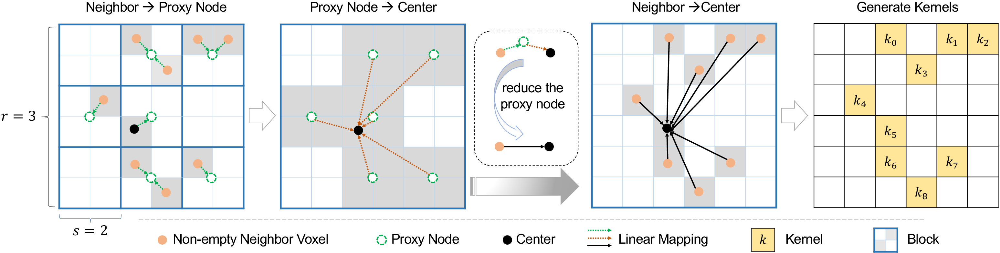

# [LinK: Linear Kernel for LiDAR-based 3D Perception](https://arxiv.org/abs/2303.16094)

Official PyTorch implementation of **LinK**, from the following paper: 

[LinK: Linear Kernel for LiDAR-based 3D Perception](https://arxiv.org/abs/2303.16094). CVPR 2023.\
[Tao Lu](https://github.com/inspirelt), [Xiang Ding](https://github.com/shawnding), [Haisong Liu](https://github.com/afterthat97), Gangshan Wu, [Limin Wang](https://wanglimin.github.io/) <br />
Multimedia Computing Group, Nanjing University \
[[`arxiv`](https://arxiv.org/abs/2303.16094)][[`Conference version`](https://openaccess.thecvf.com/content/CVPR2023/html/Lu_LinK_Linear_Kernel_for_LiDAR-Based_3D_Perception_CVPR_2023_paper.html)]


--- 

<p align="center">

</p>


**LinK** is a large kernel backbone for 3D perception tasks, consisting of a linear kernel generator and a pre-aggregation strategy. The two designs scale up the perception range into 21x21x21 with linear complexity.

---

## Model Zoo
### Segmentation on SemanticKITTI(val)

| name | kernel config |mIoU | model |
|:---:|:---:|:---:|:---:|
| LinK | cos_x:(2x3)^3 | 67.72 | [model](https://drive.google.com/file/d/1v5K2JlJ2QVmNA_D74SGxM_bvA_dRHO6d/view?usp=sharing) |
| LinK | cos:(3x7)^3 | 67.50 | [model](https://drive.google.com/file/d/1mgo_SVwEhWXS3OaGGwxmYKOOXMWOkKRi/view?usp=sharing) |
| LinK(encoder-only) | cos_x:(2x3)^3 | 67.33 | [model](https://drive.google.com/file/d/1TRsJOoL_H2v5VkXd9JMrklenw9Oy4yzQ/view?usp=sharing)|
| LinK(encoder-only) | cos:(3x5)^3 | 67.07 | [model](https://drive.google.com/file/d/1tccURuCPFnaPHg_7s82PBbb4cJXF388A/view?usp=sharing) |


### Detection on nuScenes

- Validation

| name | kernel config |NDS | mAP | model |
|:---:|:---:|:---:|:---:|:---:|
| LinK | cos:(3x7)^3 | 69.5 | 63.6 | [model](https://drive.google.com/file/d/11aGVrwkAno8baqh9YgPahM6y4iSSl5ik/view?usp=sharing) |

- Test

| name | kernel config |NDS | mAP | model |
|:---:|:---:|:---:|:---:|:---:|
| LinK | cos:(3x7)^3 | 71.0 | 66.3 | [model](https://drive.google.com/file/d/1I8hr6XLHNAIfL4LIeBn0Co87s_DEO6Oy/view?usp=sharing) |
| LinK(TTA) | cos:(3x7)^3 | 73.4 | 69.8 | [model](https://drive.google.com/file/d/1I8hr6XLHNAIfL4LIeBn0Co87s_DEO6Oy/view?usp=sharing) |


## Installation

Clone this repo to your workspace. 
```
git clone https://github.com/MCG-NJU/LinK.git
cd LinK
```

## Semantic Segmentation

please check [segmentation/INSTALL.md](segmentation/INSTALL.md) and [segmentation/GET_STARTED.md](segmentation/GET_STARTED.md).

## Detection

see [detection/INSTALL.md](detection/INSTALL.md) and [detection/GET_STARTED.md](detection/GET_STARTED.md).


## Citation

If you find our work helpful, please consider citing:
```
@InProceedings{lu2023link,
    author    = {Lu, Tao and Ding, Xiang and Liu, Haisong and Wu, Gangshan and Wang, Limin},
    title     = {LinK: Linear Kernel for LiDAR-Based 3D Perception},
    booktitle = {Proceedings of the IEEE/CVF Conference on Computer Vision and Pattern Recognition (CVPR)},
    month     = {June},
    year      = {2023},
    pages     = {1105-1115}
}
```

```
@article{lu2022app,
  title={APP-Net: Auxiliary-point-based Push and Pull Operations for Efficient Point Cloud Classification},
  author={Lu, Tao and Liu, Chunxu and Chen, Youxin and Wu, Gangshan and Wang, Limin},
  journal={arXiv preprint arXiv:2205.00847},
  year={2022}
}
```


## Contact
- Tao Lu: taolu@smail.nju.edu.cn

## Acknowledgement

Our code is based on [CenterPoint](https://github.com/tianweiy/CenterPoint), [SPVNAS](https://github.com/mit-han-lab/spvnas), [spconv](https://github.com/traveller59/spconv), [torchsparse](https://github.com/mit-han-lab/torchsparse). And we thank a lot for the kind help from [Ruixiang Zhang](https://github.com/zxczrx123), [Xu Yan](https://yanx27.github.io/) and [Yukang Chen](https://yukangchen.com/).
